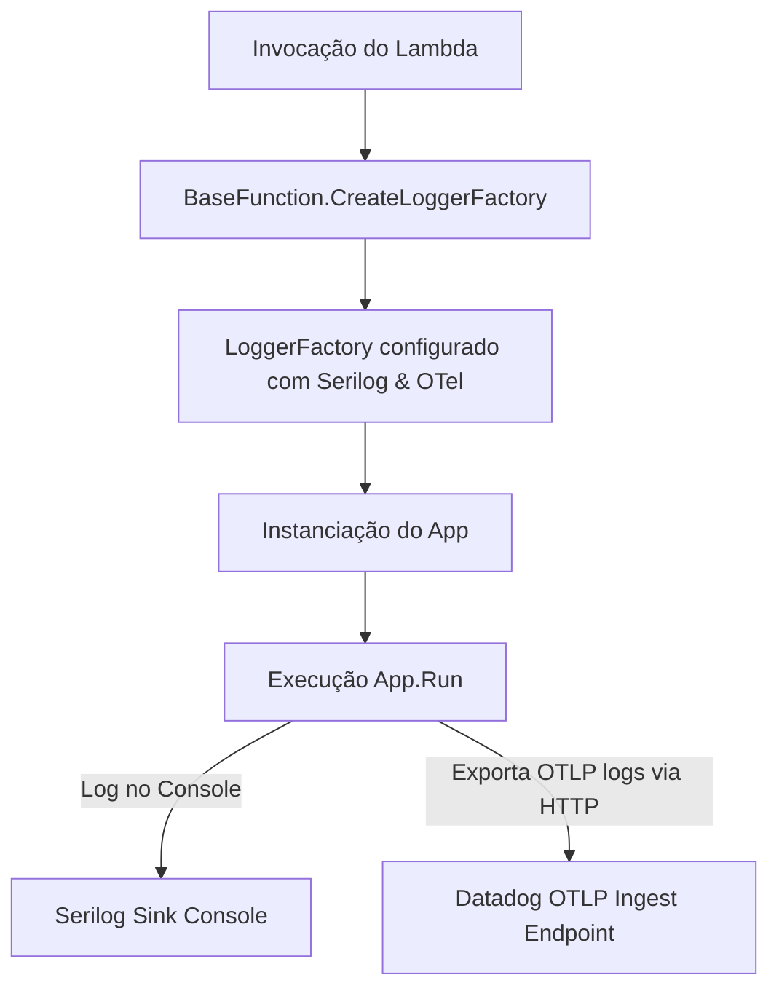

# 🚀 PoC: OpenTelemetry (OTel) logs na AWS Lambda com Datadog via OTLP

Este projeto é uma Prova de Conceito (PoC) desenvolvida em **.NET 8** para demonstrar a instrumentalização de logs em uma função **AWS Lambda** utilizando **OpenTelemetry (OTel)**, integrando e enviando os dados diretamente para o **Datadog** por meio de **OTLP (OpenTelemetry Protocol)** via HTTP.

> [!NOTE]
> O projeto utiliza uma abordagem híbrida de logging com a interface `ILogger` do .NET, direcionando mensagens tanto para o console local (através do **Serilog**) quanto para o Datadog (através do provider do **OpenTelemetry**).
>
> *Nota: O seu pedido mencionou "OpenSearch", mas esta PoC foca em **OpenTelemetry** para o pipeline de observabilidade em direção ao Datadog.*

---

## 🛠️ Tecnologias Utilizadas

- **.NET 8.0**
- **AWS Lambda** (`Amazon.Lambda.Core`, `Amazon.Lambda.Serialization.SystemTextJson`)
- **OpenTelemetry** (SDK de Logs e exportador OTLP)
- **Serilog** (Console Sink)
- **Datadog** (como backend de observabilidade via OTLP ingest)

---

## 🏗️ Estrutura do Projeto

O projeto é estruturado da seguinte forma:

- **[Program.cs](file:///home/adn/projects/a/o/Program.cs)**: Ponto de entrada para execução e testes locais. Simula a inicialização do container do Lambda.
- **[Function.cs](file:///home/adn/projects/a/o/Function.cs)**: O handler oficial do AWS Lambda (`FunctionHandler`). Executa o fluxo de negócios passando os logs para o OpenTelemetry.
- **[BaseFunction.cs](file:///home/adn/projects/a/o/BaseFunction.cs)**: Responsável por configurar e instanciar o `ILoggerFactory`, unindo os providers do Serilog (para console) e OpenTelemetry (para envio ao Datadog).
- **[App.cs](file:///home/adn/projects/a/o/App.cs)**: Simulação do código de negócio/aplicação que recebe o `ILogger` injetado e realiza operações de logs de diferentes níveis (`LogInformation`, `LogWarning`, `LogError`).
- **[OTelDatadogTest.csproj](file:///home/adn/projects/a/o/OTelDatadogTest.csproj)**: Arquivo de configuração de projeto C#, gerenciando dependências do NuGet.

---

## 🔄 Fluxo de Observabilidade



---

## ⚙️ Configuração e Variáveis de Ambiente

Para exportar os logs ao Datadog via OTLP, o exportador precisa da chave de API e do endpoint configurados. Defina as seguintes variáveis de ambiente no ambiente de execução do Lambda (ou em sua máquina local para testes):

| Variável | Descrição | Valor Padrão / Exemplo |
| :--- | :--- | :--- |
| `DD_API_KEY` | **(Obrigatório)** Sua chave de API do Datadog. | `sua_chave_aqui` |
| `OTLP_ENDPOINT` | O endpoint de Logs OTLP do Datadog. | `https://otlp.datadoghq.com/v1/logs` |

> [!IMPORTANT]
> Certifique-se de usar o endpoint correto correspondente à região da sua conta do Datadog (por exemplo, `https://otlp.datadoghq.eu/v1/logs` se a sua conta for da UE).

---

## 🚀 Como Executar Localmente

Você pode rodar o console simulator para testar o envio de logs localmente antes de fazer o deploy na AWS.

1. **Defina a variável de ambiente:**
   ```bash
   export DD_API_KEY="SUA_CHAVE_DE_API_DO_DATADOG"
   ```
2. **Execute o projeto:**
   ```bash
   dotnet run
   ```
3. **Verifique a saída:**
   - No terminal, você verá os logs formatados pelo **Serilog**.
   - No painel do **Datadog (Log Explorer)**, os logs do serviço `meu-app-dotnet-otel` estarão disponíveis para consulta.

---

## 📦 Como Publicar para AWS Lambda

Para preparar o pacote de implantação da sua função AWS Lambda:

1. **Publique o projeto:**
   ```bash
   dotnet publish -c Release -r linux-x64 --self-contained false -o ./publish
   ```
2. **Crie o arquivo ZIP para deploy:**
   Navegue até a pasta de publicação e compacte os arquivos:
   ```bash
   cd publish
   zip -r ../deploy.zip *
   ```
3. **Configure no AWS Lambda:**
   - Faça o upload do arquivo `deploy.zip`.
   - Defina o handler como: `OTelDatadogTest::Function::FunctionHandler`
   - Adicione as variáveis de ambiente `DD_API_KEY` e `OTLP_ENDPOINT`.
